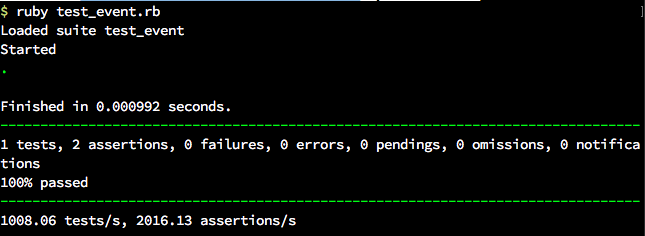

# Prova Ruby

### OBSERVAÇÕES

Leia as observações a seguir:

* A avaliação será realizada no computador, porém individualmente e em silêncio. Não deve haver nenhum tipo de comunicação entre os alunos;
* Cada questão é expresso através deste formato **QUESTÃO N (O DD%)**, o `N`é o número da questão, `O` significa que o aluno sendado na cadeira impar irá fazer essa questão, e `DD%` informa o critério de pontuação, contudo, a desorganização pode penalizar a pontuação final;
* Em cada arquivo inclua o número da questão no início do seu nome, e um bloco de comentário no início de seu conteúdo com nome e matrícula do aluno;
* Ao concluir as questões chame o professor para avaliar a prova;
* Depois da avaliação envie os arquivos num diretório compactado, seguindo o formato de nome **ALUNO-MATRICULA** para o email **lucachaves+avaliacoesdafrad20162@gmail.com** com:

> **Título:** [IFPB] Prova I DAFRAD

> **Assunto:** < nome do aluno > e < matrícula >.

### DESCRIÇÃO DA PROVA

Todas as questões são baseadas em testes unitários disponíveis através deste [link](https://github.com/ifpb/dafrad/blob/master/assessment/prova-ruby/code/). Então para executar os testes unitários é necessário possuir o ambiente ruby configurado, de preferência o ruby 2.3.

Cada questão irá detalhar um teste específico, apontando qual código será necessário executar. Por exemplo, na **QUESTÃO 1** será desenvolvido o `test_list_dates` do arquivo `code/event-wikicfp.rb/test_event.rb`, no qual é descrito todos os detalhes de entra e saída esperados no arquivo `event.rb`.

O primeiro passo para desenvolver a questão seria descomentar a função `test_list_dates` para habilitá-lo na bateria de testes. Depois se desenvolve o comportamento esperado em `event.rb`, para assim, executar o teste no terminal usando o commando:

> ~/code/event$ ruby test_event.rb

Caso o comportamento não seja o esperado, então o resultado do comando informará que existira erros na execução do teste que devem ser reparados. Mas se tudo ocorrer como esperado, o resultado será semelhante ao da Figura 1.

*Figura 1 - Resultado esperado do teste da QUESTÃO 1*

Basicamente toda a prova é elaborada em função de dois arquivos de teste, o já citado `code/event-wikicfp/test_event.rb`, e o `code/github/test_github.rb`.

O primeiro teste se trata de uma manipulação de um arquivo CSV de eventos extraídos através de informações do portal [WikiCFP](http://www.wikicfp.com/cfp/call?conference=computer%20science&page=165), já o outro teste está realicionado a informações coletadas no Web Service do Github por meio dos arquivos JSON:

* https://api.github.com/users/lucachaves/orgs
* https://api.github.com/orgs/ifpb/repos
* https://api.github.com/users/lucachaves/repos

A seguir será detalhado cada uma das questões

### QUESTÕES

**QUESTÃO 1 (O 33%) -** Construa o teste `test_list_deadlines` em `code/event-wikicfp/test_event.rb` que deve extrair do arquivo CSV as datas dos eventos. Portanto, o teste espera receber do objeto `Event` as datas nesse formato:

> ["May 20, 2016", "May 19, 2016", "May 15, 2016", "May 13, 2016", "May 12, 2016", "May 10, 2016"]

**QUESTÃO 2 (E 33%) -** Construa o teste `test_list_cities` em `code/event-wikicfp/test_event.rb` que deve extrair do arquivo CSV os locais dos eventos. Portanto, o teste espera receber do objeto `Event` as cidades nesse formato:

> [
  "Allerton Park, IL, USA",
  "Atlanta, Georgia, USA",
  "Cardiff, UK",
  "Chongqing, China",
  "Edinburgh, Scotland",
  "London, UK",
  "Montreal, Canada",
  "Paris, France",
  "Philadelphia, PA USA",
  "Ploiesti, Romania",
  "Porto, Portugal",
  "Prague, Czech Republic",
  "Vienna, Austria"
]

**QUESTÃO 3 (E 33%) -** Construa o teste `test_get_events_by_deadline` em `code/event-wikicfp/test_event.rb` que deve extrair do arquivo CSV os nomes dos eventos através do seu deadline. Portanto, o teste espera receber do objeto  `Event` o deadline nesse formato:

> "May 20, 2016"

e deve retornar:

> ["ECAI 2016", "IEEE DSAA'2016", "RW-BPMS 2016"]

Mas se for passado uma faixa de datas dos deadlines usando esse formato:

> "May 20, 2016", "May 19, 2016"

o objeto deve retornar os deadlines deste intervalo:

> ["ECAI 2016", "IEEE DSAA'2016", "PLoP 2016", "RW-BPMS 2016"]

**QUESTÃO 4 (O 33%) -** Construa o teste `test_get_events_by_city` em `code/event-wikicfp/test_event.rb` que deve extrair do arquivo CSV os nomes dos eventos através do local do evento. Portanto, o teste espera receber do objeto  `Event` o local do evento nesse formato:

> "Porto, Portugal"

e espera retornar:

> ["IC3K 2016", "IJCCI 2016", "KDIR 2016", "KEOD 2016", "KMIS 2016"]

**QUESTÃO 5 (O 33%) -** Construa o teste `test_list_repositories` em `code/github/test_github.rb` que deve extrair dos Web Services do Github os nomes dos respositórios através do usuário ou organização. Portanto, o teste espera receber do objeto `Github` o usuário ou organização nesse formato:

> "ifpb"

e espera retornar:

> {
  :dafrad=>"https://github.com/ifpb/dafrad",
  :"dafrad-20161"=>"https://github.com/ifpb/dafrad-20161",
  :dw=>"https://github.com/ifpb/dw",
  :"dw-20161"=>"https://github.com/ifpb/dw-20161",
  :jaguaribetech=>"https://github.com/ifpb/jaguaribetech",
  :lm=>"https://github.com/ifpb/lm",
  :ls=>"https://github.com/ifpb/ls",
  :"ls-20161"=>"https://github.com/ifpb/ls-20161",
  :"projeto-estagio"=>"https://github.com/ifpb/projeto-estagio"
}

**QUESTÃO 6 (E 33%) -** Construa o teste `test_list_organizations` em `code/github/test_github.rb` que deve extrair dos Web Services do Github os nomes das organizações de um usuário através da informação do nome de sua conta. Portanto, o teste espera receber do objeto `Github` o nome do usuário nesse formato:

> "lucachaves"

e esperar retornar:

>{
  ifpb: "https://github.com/ifpb",
  sidegroup: "https://github.com/sidegroup"
}
